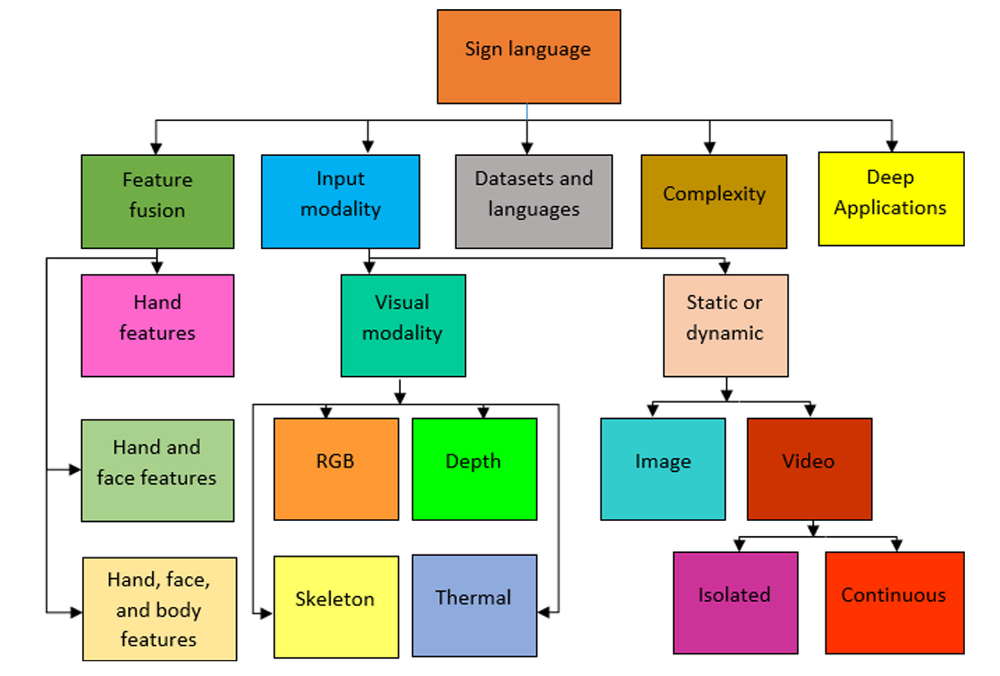
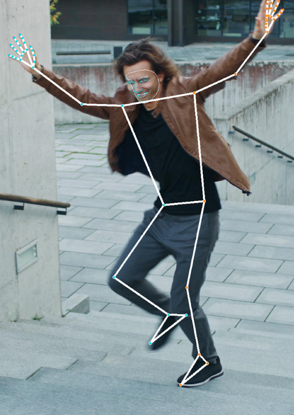

[#rrl]
== Review of Related Literature

This chapter investigates literature that explores similar problems and solutions. It provides an overview of sign language recognition (SLR) technologies and their goals and techniques. It begins with general technologies and narrows towards the scope of this study: providing feedback for learners of Filipino Sign Language (FSL).

[#theoretical]
=== Theoretical Background

This study focuses on determining the correctness of sign language gestures and providing feedback. This may fall under sign language recognition; as such, it falls under the general areas of computer vision and human-computer interactions.

// see src/manuscript.adoc for explanation how to make figures
:fig-label-taxonomy: {fig-label} {counter:fig}
.{fig-label-taxonomy}. Taxonomy of Sign Language Models cite:[rastgoo21]
[#fig-taxonomy]

Rastgoo et al. cite:[rastgoo21] performed a survey on sign language recognition techniques and created a taxonomy to classify them, as seen in <<fig-taxonomy,{fig-label-taxonomy}>>. Of interest is the classification according to input modality. This study is interested in techniques that avoid the use of specialized technologies, such as depth sensors. As such, the works discussed here fall under color-based techniques. However, some may also be classified as skeleton-based techniques, as they rely on external dependencies to transform images or videos into keypoints. This study is also specifically interested in dynamic recognition, which focuses on videos, but some works on static recognition, which focuses on still images, are also discussed.

This study is modeled after the work of Paudyal et al. cite:[paudyal19], which has the most similar goals and scope. It compares a learner's gestures with that of a reference video using several feature extraction methods, namely: location bucketing, dynamic time warping, keypoint estimation. More details are described in <<methodology>>: <<model>>.

[#technical]
=== Technical Background

// see src/manuscript.adoc for explanation how to make figures
:fig-label-holistic: {fig-label} {counter:fig}
.{fig-label-holistic}. Example of keypoint estimation with MediaPipe Holistic cite:[ivan20]
[#fig-holistic]

While <<theoretical>> discusses the techniques used within the model, this section discusses the technologies involved. Python cite:[python] will be used due to the availability of libraries for data manipulation and analysis such as NumPy cite:[numpy]. For keypoint estimation, MediaPipe cite:[mediapipe] will be used, as seen in <<fig-holistic,{fig-label-holistic}>>.

[#slr]
=== Sign Language Recognition

The researchers are looking into different papers about sign language recognition, as this is the larger umbrella which Filipino sign language can be applied. Papers like Wadhawan et al. cite:[wadhawan21], were focused on creating a system of a Systematic Literature Review and a classification scheme. Because of this they selected, reviewed, and classified one hundred seventeen other papers about sign language recognition systems while categorizing with the basis of twenty-five sign languages and it was further compared to the six dimensions, they have mentioned in their paper which was data acquisition techniques, static/dynamic signs, signing mode, single/double handed signs, classification technique and recognition rate.

With a paper that has selected and categorized a decade worth of sign language recognition systems, from there the researchers found that there will be different techniques for data acquisition for hand gestures just like with a paper made by Cheok et al. cite:[cheok19] which they categorized into data acquisition, pre-processing, segmentation, feature extraction and classification with the help of computer vision, gesture recognition, image processing, and machine learning. To add on to this, a paper from Camgoz et al. cite:[camgoz20] that created a system-based architecture that jointly learns continuous sign language recognition and sign language translation they were able to achieve this by applying the use of a connectionist temporal classification. Lastly the researchers had considered looking into the techniques that uses convolutional neural network models, the researchers found two papers that highlighted the use of the convolutional neural network one from Wadhawan et al. cite:[wadhawan21] which they used deep learning for Indian sign language recognition that utilizes approximately fifty convolutional neural network models with over thirty-five thousand signed images from one hundred static signs that were collected from different users to help with their study as they were able to achieve a highest training accuracy of 99.72% and 99.90%, the other study from Rahman et el. cite:[rahman19] proposed an American sign language recognition convolutional neural network model as they wanted to enhance the accuracy of already existing models, the dataset they used for their study was public datasets that contains the alphabetical and numerical American signs, at the end of their paper they were able to achieved a 9% improved accuracy from that model.

Al-Qurishi et al. cite:[alqurishi21] mentioned the combination of various features, such as hands and facial regions, can be beneficial in sign language recognition. However, integrating these features can be complex due to the diverse formats of data involved. While hand extraction is crucial for successful sign language recognition, challenges persist in tasks such as hand positions, hand shape and gesture, and movement tracking.

Al-Qurishi et al. cite:[alqurishi21] consider the factors like the variability in the sizes and shapes of hands and fingers among different signers. Rastgoo et al. cite:[rastgoo21] also introduced the concept of hands potentially holding objects and varying in size based on the distance between the signer and the camera. To address these issues, Al-Qurishi et al. have incorporated facial characteristics into the analysis, thereby improving accuracy.

[#fslr]
=== Filipino Sign Language Recognition

While research on Filipino Sign Language Recognition is still considered premature, several existing studies on Filipino Sign Language focus on models that recognize, identify, and translate signs made by FSL users. Different methods were used to develop these models, from using Microsoft Kinect's motion sensors to using Recurrent Neural Network (RNN) models.

Recent studies on FSLR involves the use of deep learning models such as Convolutional Neural Networks (CNN) and Recurrent Neural Networks (RNN). CNNs are used on static datasets such as images of the alphabet signs and number signs while RNNs are used in video datasets that contains dynamic signs such as greetings and common phrases. Some studies combine the two deep learning models to create a hybrid model that can serve as a combined feature extraction model and recognition model.

Montefalcon et al. cite:[montefalcon21] used a CNN model based on the Residual Network (ResNet) architecture and computer vision to develop a Filipino Sign Language recognition model. Their study used a dataset of static images consisting of numeric and alphabet signs in FSL. Cabutaje et al. cite:[cabutaje23] also used a similar dataset but focused on alphabet recognition. Both studies showed promising results, with Montefalcon’s study producing an 86.7% validation accuracy at the 15th epoch and Cabutaje’s producing a 93% validation accuracy. 

Another study by Montefalcon et al. cite:[montefalcon23] focused on the recognition of dynamic signs, which both includes the facial and hand movement made by the signer – among other parameters. They used a RNN (Long Short-Term Memory) and CNN (ResNet architecture) to determine which model performs better in terms of sign language recognition. In addition, they used MediaPipe Holistic from Google to track different features from the video sequences for their feature importance analysis. Similar to their previous study, their models showed promising results, with the ResNet model producing an 87% accuracy and the LSTM model with 94% accuracy.

Rivera & Ong cite:[rivera18] highlighted the importance of non-manual signals in Filipino Sign Language. Sign languages are composed of two components: manual signals--which refer to the hand gestures, shapes, and positions--and non-manual signals--which involve the signer's facial expressions, and upper body posture and movements. Non-manual signals in FSL are used to determine the user's emotions, and to convey degrees of adjectives. Montefalcon et al.'s cite:[montefalcon23] paper on FSL dynamic signs conducted a feature importance analysis and has found that removal of significant features of the signer, such as the signer's facial components, has negatively impacted the performance of the models.

These promising results come with its issues. Both studies by Montefalcon et al. had problems with misclassification of signs. In Montefalcon’s study on static signs, the model confused the signs of the number 2 and number 6 due to its similarity in finger orientation and finger edges. In the study of dynamic sign recognition, the Filipino phrase "`Kumusta ka?`" was frequently identified as the phrase "`Maligayang kaarawan.`" This misclassification problem is often blamed on lack of training samples – and it is considered a common difficulty in premature research topics.

[#tools]
=== Explainable Artificial Intelligence Techniques for Sign Language Recognition

Most techniques identified have focused on the translation of gestures into text using deep learning techniques. Though powerful, these techniques provide little insight into the internal mechanisms used to determine the gesture's meaning and provide feedback. Some studies address this using explainable AI (XAI) techniques. Those that fall under a similar scope as discussed in <<theoretical>> are the works of Kothadiya et al. cite:[kothadiya23] and Paudyal et al. cite:[paudyal19].

Kothadiya et al. cite:[kothadiya23] apply XAI techniques to deep learning models, exposing the areas of the images that were most influential to the model. However, the feedback these provided is limited to a heatmap overlay. While this accomplishes their goals, it does not provide the detailed feedback this study aims to achieve.

Paudyal et al. cite:[paudyal19] share the most similar goals to this study. Rather than translating gestures into text like other works discussed here, their study focuses on providing feedback to learners. They do this using a series of feature extraction techniques that focus on hand location, movement, and shape. However, as Montefalcon et al. cite:[montefalcon23] showed, facial features are an important component of FSL, and Paudyal et al. cite:[paudyal19] fail to account for this.

[#synthesis]
=== Synthesis

Most sign language technologies identified in this work focuses specifically on translating gestures into text. Many also use deep learning techniques, allowing for impressive translation capabilities. However, these do little in regard to providing feedback to learners. Paudyal et al. cite:[paudyal19] come closest to achieving the goals of this study, using a series of feature extraction techniques to determine the correctness and provide feedback. However, it fails to consider other components of gestures that are important to Filipino Sign Language. As such, this study will be modeled after the work of Paudyal et al. cite:[paudyal19], with modifications to account for facial features in Filipino Sign Language.
