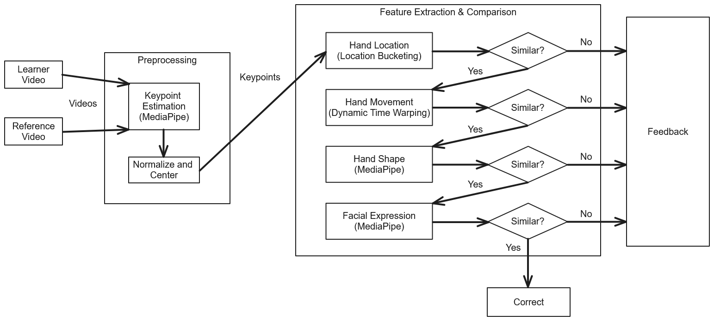
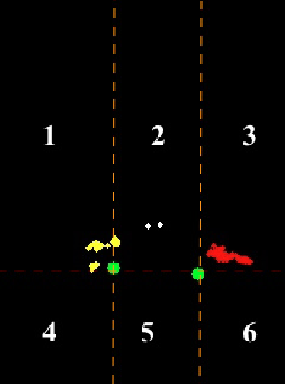
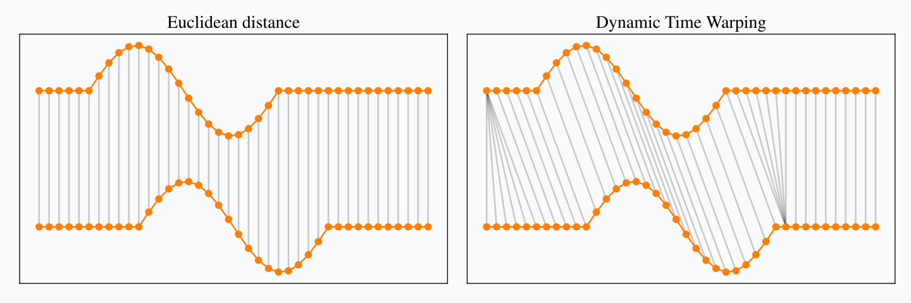

[#methodology]
== Methodology

This chapter details the specific processes involved in achieving the objectives outlined in <<intro>>: <<objectives>>. This study is modeled after the work of Paudyal et al. cite:[paudyal19]. As such, much of this study follows similar methods. However, it also introduces modifications aimed to improve the model, specifically in the context of Filipino Sign Language (FSL). Other modifications are also introduced to take advantage of better technologies that have been made available since the publishing of the aforementioned previous work.

[#data]
=== Data Collection

This study will be using a public dataset known as FSL-105 cite:[tupal23]. It contains 105 different Filipino Sign Language gestures and was created by a team from De La Salle University. In total, it consists of 2130 4-second clips. 16 FSL gestures will be selected as the sample for testing the model's ability to determine correct and incorrect attempts, as these signs are more dynamic compared to the rest of the dataset.

[#preprocessing]
=== Data Preprocessing

// see src/manuscript.adoc for explanation how to make figures
:fig-label-pose: {fig-label} {counter:fig}
.{fig-label-pose}. Example pose estimation with MediaPipe cite:[mediapipePose]
[#fig-pose]
image::../images/mediapipe_pose.png[MediaPipe pose estimation]

The video data from the dataset will be preprocessed to estimate pose data from the videos, as seen in <<fig-pose,{fig-label-pose}>>. This pose data will be in the form of keypoints, or the locations of the signer's joints within the video. Unlike the work of Paudyal et al. cite:[paudyal19], which relies on PoseNet, this will be done with the use Google's MediaPipe framework, which also includes more detailed hand and face keypoint estimations. However, this data may still contain noise in the form of varying scale and location introduced by variations in camera location and settings. To account for this, the data will be normalized; joints will be scaled and translated to be a consistent size within the center of the frame.

[#model]
=== Model Development

// see src/manuscript.adoc for explanation how to make figures
:fig-label-framework: {fig-label} {counter:fig}
.{fig-label-framework}. Techniques and Technologies
[#fig-framework]

<<fig-framework,{fig-label-framework}>> shows the framework of the model to be created, as well as its differences from the model developed by Paudyal et al. cite:[paudyal19]. Paudyal et al. showcased the effectiveness of a model composed of three modules, each of which analyzes a specific component of gestures: hand location, movement, and shape. In this model, estimated keypoints are put through the modules, and each module calculates a measure of similarity. This measure of similarity may be in the form of a similarity score, where higher is better, or an error score, where lower is better. Failure to meet a certain threshold of similarity set for each module will provide feedback to the learner. This study introduces a fourth module for facial features, as these are an important component in Filipino Sign Language cite:[montefalcon23]. It also modifies the shape module due to various factors detailed in <<shape>>.

Each module is developed independently. However, in the context of an application, these modules are to be invoked sequentially: a module is only invoked in the case that the preceding module determines that the gesture is correct. This design is intentional due to the following factors. First, running only one module at a time when needed reduces computational load; this allows for faster feedback. Second, it allows learners to focus on incremental improvements. The gesture is deemed correct if all modules determine that the gesture is correct.

Other than allowing for detailed feedback, the use of feature extraction methods, as opposed to more sophisticated machine learning models, allows for the trivial addition of gestures and avoids requiring extensive datasets. Rather than having to retrain models when new gestures are added, new reference gestures simply need to be added to compare the learner's gestures to.

[#location]
==== Hand Location

// see src/manuscript.adoc for explanation how to make figures
:fig-label-bucket: {fig-label} {counter:fig}
.{fig-label-bucket}. "`Location bucketing`" example cite:[paudyal19]
[#fig-bucket]

To determine the signer's hand location, the frame will be divided into six sections (dubbed "`buckets`") based on the location of the signer's shoulders. This is because it is the relative positions of the hands that matter--not the absolute positions cite:[bajernee20]. The presence of hands will be tracked within each bucket throughout the gesture, as seen in <<fig-bucket,{fig-label-bucket}>>. Each bucket will be a component of a vector, resulting in a vector with six components. This can be thought of as an arrow "`pointing`" somewhere in a six-dimensional space. The resulting vector from the learner's gesture will then be compared to the reference gesture using cosine similarity, as one of the applications of the cosine function, at a high level, is to determine how similarly two multidimensional vectors are "`pointing`".

[#movement]
==== Hand Movement

// see src/manuscript.adoc for explanation how to make figures
:fig-label-dtw: {fig-label} {counter:fig}
.{fig-label-dtw}. Illustration of Euclidean distance vs dynamic time warping cite:[tavenard21]
[#fig-dtw]

To determine the correctness of the hand movement, dynamic time warping will be performed between the learner's gesture and the reference gesture. This technique maps two sequences to each other based on similar features, as seen in <<fig-dtw,{fig-label-dtw}>>. The distance calculated between the two will determine the similarity of the two movements. However, before this is performed, this module requires an additional preprocessing step. This module is affected by variations in video lengths; to address this, longer videos will be down-sampled to keep lengths consistent.

[#shape]
==== Hand Shape

// see src/manuscript.adoc for explanation how to make figures
:fig-label-hand: {fig-label} {counter:fig}
.{fig-label-hand}. Example of hand keypoint estimation with MediaPipe cite:[mediapipeHand]
[#fig-hand]
image::../images/mediapipe_hand.png[MediaPipe gesture estimation]

Using the pose estimation obtained in <<preprocessing>>, the videos will be cropped to focus on the signer's hands. At this point, Paudyal et al. cite:[paudyal19] use a convolutional neural network for feature extraction. This approach is not suitable for this study due to the use of a smaller dataset that would be ineffective in the training of a model. However, finding other techniques for comparing hand shapes that avoid the training of a model may be beneficial, as it would avoid overfitting and negate the need to retrain the model when new gestures are added. This study will take advantage of MediaPipe's hand landmark estimation model to estimate the hand shape as well, as seen in <<fig-hand,{fig-label-hand}>>. Similar preprocessing steps to normalize the scale and position will be performed. The similarity between the learner's hand shape and the reference hand shape will be determined using cosine similarity. Cosine similarity is described in <<location>>, and can be applied here as well--though with more components/dimensions--as the hand shape may be stored as a vector composed of its keypoints' coordinates.

[#face]
==== Facial Features

Montefalcon et al. cite:[montefalcon23] showed that facial features affect the recognition of Filipino Sign Language (FSL). As such, this study introduces the facial feature module to aid in providing feedback to FSL learners. This module works similarly to the hand shape module. The pose estimation obtained in <<preprocessing>> includes facial features. This data will be normalized, and specific keypoints will be selected based on the work of Huang and Huang cite:[huang97]. The similarity between the learner's gesture and the reference gesture will then be calculated similarly to the <<shape>>.

[#assessment]
=== Model Assessment

The model will be assessed using a binary classification task. Here, the model will compare two videos to determine if they are of the same gesture or not. To do this, videos must be paired up. For each gesture in the subset of 16 gestures described in <<preprocessing>>, a random video will be chosen as a reference video for other videos to be compared to. Then, an equal number of other videos of the same gesture and number of videos of different gestures will be chosen to be compared against the reference video to avoid a class imbalance. Each of these pairings will be a single sample.

These samples will be used to find thresholds and assess the model. This will be done through the use of multiple train-test splits through k-folds cross validation to avoid a biased test split. These samples will be shuffled and split into four folds, where for each iteration, one fold will be used for assessing the model, and the rest will be used for finding thresholds.

Because this study is exploring the use of a new model, it is still unclear how to determine the best thresholds. For this study, thresholds are experimentally determined to balance accuracy, precision, and recall. The recall score is slightly more prioritized to prevent the prevalence of false negatives. This is because modules will be chained together; other modules may be able to correct false positives, but false negatives cannot be corrected.

Once thresholds are found, the test data will be put through the combined modules, and the model output will be compared to the ground truth. This will yield a confusion matrix where metrics such as accuracy, precision, recall, and F1 score can be calculated. To determine the effect of the introduced face module, a version of the model without will also be assessed and compared.
