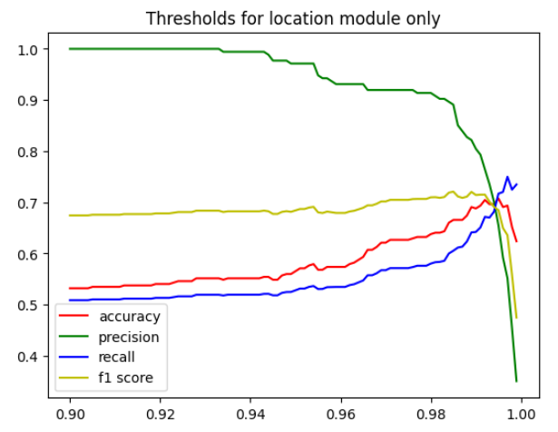
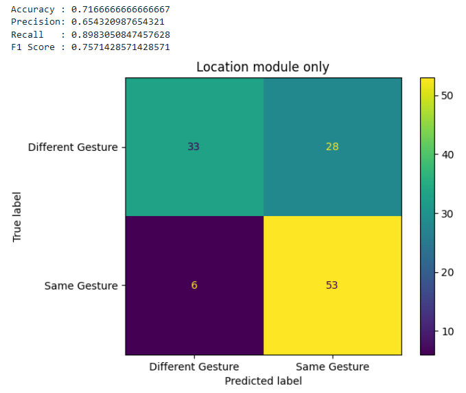
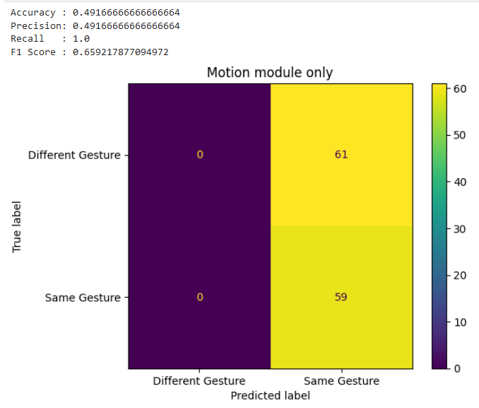
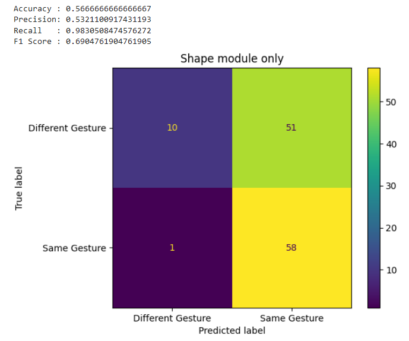
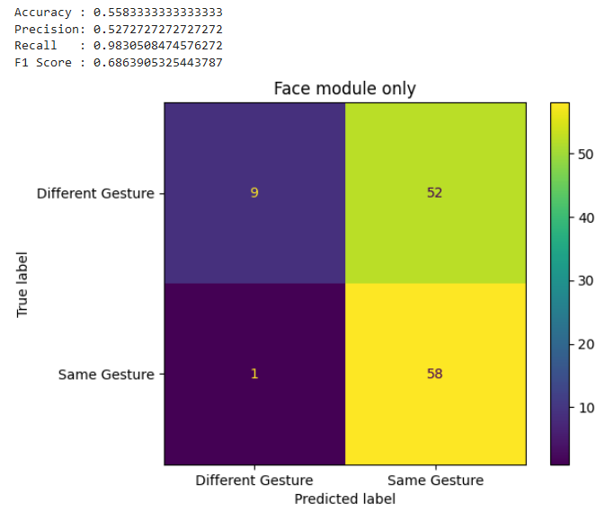
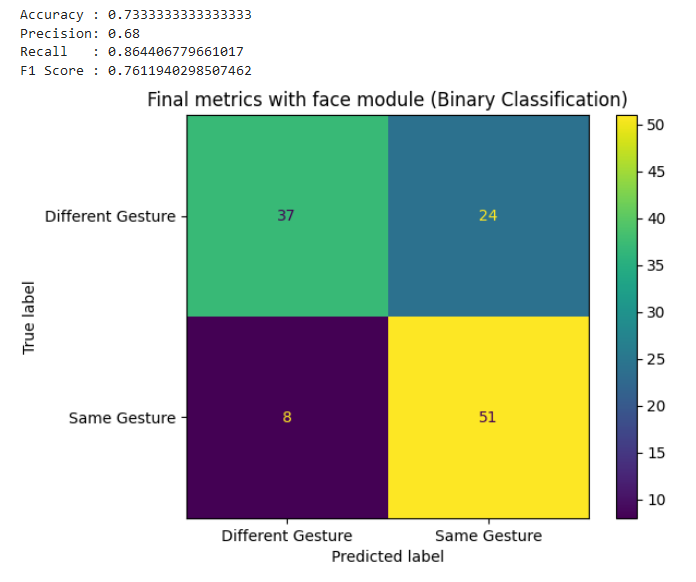

[#rnd]
== Results and Discussion

This chapter details the data gathered by following the procedures outlined in <<methodology>>. It also discusses insights regarding this data.

[#results]
=== Results

A model was successfully created as described in <<methodology>>: <<model>> and was assessed as described in <<methodology>>: <<assessment>>.

This involves a binary classification task, where the model will predict if two videos are of the same gesture. As such, pairings of videos were used as samples. 16 gestures were used for this task. For each of these, a random video was chosen as a reference video for other videos to be compared to. 15 samples, or pairs, were made with a random different video of the same gesture to serve as correct attempts, and 15 samples were made with a random video of a random different gesture to serve as incorrect attempts. In total, 478 samples were used (latexmath:[16\text{ gestures} * (15\text{ correct pairings} + \text{ 15 incorrect pairings}) = 480\text{ samples}], with two sample outliers).

Finding thresholds and testing were done in with k-folds cross validation to simulate multiple train-test splits to avoid testing with biased test data. A value of latexmath:[k=4] was used for creating folds, resulting in four iterations of 75-25 train-test splits.

==== One iteration

:fig-label-locgraph: {fig-label} {counter:fig}
.{fig-label-locgraph}. Example of threshold lookup graph (Location module).
[#fig-locgraph]

Finding the best threshold in each module required generating a graph to visualize the possible evaluation metrics for an experimental threshold. While it is ideal to find a threshold that produces high accuracy and precision, higher recall was prioritized to reduce the number of false negatives. The figure above (<<fig-locgraph,{fig-label-locgraph}>>) is an example of a graph used to find the best threshold for the location module. 

:fig-label-locmod: {fig-label} {counter:fig}
.{fig-label-locmod}. Performance metrics and confusion matrix for location module for one iteration.
[#fig-locmod]

Multiple experimental thresholds were tested on the location module across four iterations to identify the threshold that achieves the most balanced performance metrics. <<fig-locmod,{fig-label-locmod}>> presents the performance metrics and confusion matrix for the optimal threshold selected for the location module. The threshold set at 0.985 produced the highest, balanced metrics out of the iterations, with 71.67% accuracy, 65.43% precision, 89.83% recall, and 75.71% F1 score.

:fig-label-motionmod: {fig-label} {counter:fig}
.{fig-label-motionmod}. Performance metrics and confusion matrix for movement module for one iteration.
[#fig-motionmod]

<<fig-motionmod,{fig-label-motionmod}>> shows the performance metrics and the confusion matrix for the optimal threshold set for the motion module. The experimental threshold set at 0.5 yielded the following performance scores: 49.17% accuracy, 49.17% precision, 100% recall, and an F1 score of 65.92%. Further explanation of the confusion matrix results will be addressed in <<discussion>>.

:fig-label-shapemod: {fig-label} {counter:fig}
.{fig-label-shapemod}. Performance metrics and confusion matrix for shape module for one iteration.
[#fig-shapemod]

<<fig-shapemod,{fig-label-shapemod}>> shows the performance metrics and the confusion matrix for the optimal threshold set for the shape module. The selected experimental threshold at 0.92 resulted in performance metrics of 56.67% for accuracy, 53.21% for precision, 98.31% for recall, and an F1 score of 69.05%.

:fig-label-facemod: {fig-label} {counter:fig}
.{fig-label-facemod}. Performance metrics and confusion matrix for face module for one iteration.
[#fig-facemod]

In the last module, <<fig-facemod,{fig-label-facemod}>> shows the performance metrics and the confusion matrix for the optimal threshold set for the face module. The experimental threshold set at 0.99 produced the following performance metrics: 55.83% accuracy, 52.73% precision, 98.31% recall, and an F1 score of 68.64%.

:fig-label-overallbin: {fig-label} {counter:fig}
.{fig-label-overallbin}. Overall binary classification model (with face module) for one iteration.
[#fig-overallbin]

The experimental thresholds that produced the highest and most balanced metrics for each module were then combined to evaluate the overall performance of the model. <<fig-overallbin,{fig-label-overallbin}>> shows the performance metrics and confusion matrix of the model with the combined experimental thresholds for each module. The model had 73.33% accuracy, 68.0% precision, 86.44% recall, and 76.12% F1 score. 

:fig-label-overallbin1: {fig-label} {counter:fig}
.{fig-label-overallbin1}. Overall binary classification model (without face module) for one iteration.
[#fig-overallbin1]
image::../images/overall-binary-without-face.png[Binary classification model without face, scaledwidth=50%]

To provide a basis for comparison with cite:[paudyal19] work, a model without the face module was also evaluated. <<fig-overallbin1,{fig-label-overallbin1}>> shows the performance metrics and the confusion matrix of the model excluding the face module. The model had 71.67% accuracy, 65.82% precision, 88.14% recall, and 75.36% F1 score.

:table-label-modules: {table-label} {counter:table}
.{table-label-modules}. Individual module metrics for one iteration.
[#table-modules]
[%header,cols=6*]
|===
s|Module
s|Threshold
s|Accuracy
s|Precision
s|Recall
s|F1 Score

h|Location
>|0.985
>|71.67%
>|65.43%
>|89.83%
>|75.71%

h|Movement
>|0.500
>|49.17%
>|49.17%
>|100.0%
>|65.92%

h|Shape
>|0.920
>|56.67%
>|53.21%
>|98.31%
>|69.05%

h|Face
>|0.990
>|55.83%
>|52.73%
>|98.31%
>|68.64%
|===

<<table-modules,{table-label-modules}>> shows the metrics obtained by each individual module when used on the testing data. As mentioned in <<methodology>>: <<assessment>>, experimental thresholds with high recall are prioritized to reduce the number of false negatives. Each module can be seen to have performed decently as independent modules, with the location performing better than the other modules.

:table-label-models: {table-label} {counter:table}
.{table-label-models}. Model metrics with and without face module for one iteration.
[#table-models]
[%header,cols=5*]
|===
s|Model
s|Accuracy
s|Precision
s|Recall
s|F1 Score

h|With face
>|73.33%
>|68.00%
>|86.44%
>|76.12%

h|Without face
>|71.67%
>|65.82%
>|88.14%
>|75.36%
|===

<<table-models,{table-label-models}>> shows the metrics achieved by combining the modules. Compared to the individual modules seen in <<table-modules,{table-label-modules}>>, combining the modules led to better performance metrics overall. The model excluding the face module was also included to determine the impact of including a facial features module, as well as to assess the performance in comparison to the original work of Paudyal et al. cite:[paudyal19].

==== All iterations

To prevent biased samples in the test fold, finding thresholds and testing the model was conducted multiple times using k-folds cross validation. The results discussed thus far have been referring to one iteration of the cross validation. This section details the results found across all iterations.

:table-label-location-average: {table-label} {counter:table}
.{table-label-location-average}. Location module threshold and performance across iterations.
[#table-location-average]
[%header,cols=6*]
|===
s|
s|Threshold
s|Accuracy
s|Precision
s|Recall
s|F1 Score

h|Iteration 1
>|0.985
>|63.03%
>|62.65%
>|80.00%
>|70.27%

h|Iteration 2
>|0.985
>|64.17%
>|55.95%
>|88.68%
>|68.61%

h|Iteration 3
>|0.985
>|63.80%
>|60.44%
>|88.71%
>|71.90%

h|Iteration 4
>|0.985
>|71.67%
>|65.43%
>|89.83%
>|75.71%

h|Average
>|
>|65.67%
>|61.12%
>|86.81%
>|71.62%
|===

:table-label-motion-average: {table-label} {counter:table}
.{table-label-motion-average}. Motion module threshold and performance across iterations.
[#table-motion-average]
[%header,cols=6*]
|===
s|
s|Threshold
s|Accuracy
s|Precision
s|Recall
s|F1 Score

h|Iteration 1
>|0.5
>|54.62%
>|54.62%
>|100%
>|70.65%

h|Iteration 2
>|0.5
>|44.12%
>|44.17%
>|100%
>|61.27%

h|Iteration 3
>|0.5
>|52.10%
>|52.10%
>|100%
>|68.51%

h|Iteration 4
>|0.5
>|49.17%
>|49.17%
>|100%
>|65.92%

h|Average
>|
>|50.02%
>|50.02%
>|100%
>|66.59%
|===

:table-label-shape-average: {table-label} {counter:table}
.{table-label-shape-average}. Shape module threshold and performance across iterations.
[#table-shape-average]
[%header,cols=6*]
|===
s|
s|Threshold
s|Accuracy
s|Precision
s|Recall
s|F1 Score

h|Iteration 1
>|0.95
>|62.18%
>|62.20%
>|78.46%
>|69.39%

h|Iteration 2
>|0.95
>|58.33%
>|51.89%
>|77.36%
>|62.12%

h|Iteration 3
>|0.95
>|61.34%
>|60.00%
>|77.42%
>|67.61%

h|Iteration 4
>|0.92
>|56.67%
>|53.21%
>|98.31%
>|69.05%

h|Average
>|
>|59.63%
>|56.83%
>|82.89%
>|67.04%
|===

:table-label-face-average: {table-label} {counter:table}
.{table-label-face-average}. Face module threshold and performance across iterations.
[#table-face-average]
[%header,cols=6*]
|===
s|
s|Threshold
s|Accuracy
s|Precision
s|Recall
s|F1 Score

h|Iteration 1
>|0.99
>|57.14%
>|56.48%
>|93.85%
>|70.52%

h|Iteration 2
>|0.99
>|46.67%
>|45.22%
>|98.11%
>|61.90%

h|Iteration 3
>|0.99
>|51.26%
>|51.92%
>|87.10%
>|65.06%

h|Iteration 4
>|0.99
>|55.83%
>|52.73%
>|98.31%
>|68.64%

h|Average
>|
>|52.73%
>|51.59%
>|94.34%
>|66.53%
|===

<<table-location-average,{table-label-location-average}>>, <<table-motion-average,{table-label-motion-average}>>, <<table-shape-average,{table-label-shape-average}>>, and <<table-face-average,{table-label-face-average}>> show the thresholds used and metrics obtained for each module for each iteration. It also shows the average metrics across all iterations.

:table-label-overall-with-face: {table-label} {counter:table}
.{table-label-overall-with-face}. Model metrics with face module across iterations.
[#table-overall-with-face]
[%header,cols=5*]
|===
s|
s|Accuracy
s|Precision
s|Recall
s|F1 Score

h|Iteration 1
>|63.87%
>|68.33%
>|63.07%
>|65.60%

h|Iteration 2
>|68.33%
>|62.30%
>|71.70%
>|66.f7%

h|Iteration 3
>|63.87%
>|67.27%
>|59.68%
>|63.25%

h|Iteration 4
>|73.33%
>|68.00%
>|86.44%
>|76.12%

h|Average
>|67.35%
>|66.48%
>|70.22%
>|67.91%
|===

<<table-overall-with-face,{table-label-overall-with-face}>> shows the results of combining all module across all iterations and the average results obtained.

:table-label-overall-without-face: {table-label} {counter:table}
.{table-label-overall-without-face}. Model metrics without face module across iterations.
[#table-overall-without-face]
[%header,cols=5*]
|===
s|
s|Accuracy
s|Precision
s|Recall
s|F1 Score

h|Iteration 1
>|63.87%
>|66.66%
>|67.69%
>|67.18%

h|Iteration 2
>|66.67%
>|60.00%
>|73.58%
>|66.10%

h|Iteration 3
>|64.71%
>|65.63%
>|67.74%
>|66.67%

h|Iteration 4
>|71.67%
>|65.82%
>|88.14%
>|75.36%

h|Average
>|66.73%
>|64.53%
>|74.29%
>|68.83%
|===

The same was done without the face module, the results of which are shown in <<table-overall-without-face, {{table-label-overall-without-face}}>>.

[#discussion]
=== Discussion

The thresholds set for the modules were experimentally chosen in an attempt to balance the different metrics. The model works by chaining together modules by only deeming a pairing correct if all modules output that the pairing is correct. Each additional module only identifies more negative samples. Because of this, while it is ideal for each module to achieve high accuracy and precision, it is also important to maintain a high recall to limit the number of false negatives.

As seen in <<table-modules,{table-label-modules}>>, the location module seems to be the most capable of classifying the difference between a video of gesture to another. Meanwhile, as seen in <<table-models,{table-label-models}>>, combining all the four modules together achieves better performance metrics compared to the performance of the individual modules. This shows that combining the modules can create a better performing model overall.

To determine the effects of the inclusion of the facial features module, a model without the face module was also tested. Compared to individual modules, this model also achieves a better overall performance. Compared to the model which includes the face module, there is a marginal decrease in the overall performance metrics. According to the confusion matrices, the model including the face module was able to correct four samples from the model without the face module.

While these results prove the model is somewhat effective, they fall short of the results obtained by Paudyal et al. cite:[paudyal19]. This may be due to the use of a different dataset, as well as discrepancies in the processing of the data. Some of the gestures that Paudyal et al. cite:[paudyal19] used in their work are somewhat more static in nature than dynamic. The gestures selected in this study are greetings and phrases, which are more dynamic thus more complicated to process. Paudyal’s work also included a significantly larger sample size compared to the present study.

To address the marginal improvement of the model when including the face module, there have been variations with the sample data used in this study. While the dataset includes enough samples per gesture for training, variations within the same gesture is presumed to be considered by the model as a subsample of the same gesture. For example, the gesture "you're welcome" in FSL can be executed with lip movement and without lip movement - and the intended meaning remains unchanged. Instead of relying on a consistent reference video for learning, the model was trained using two or more variations of the same sign. While this approach is beneficial for capturing variability, the small size of the sample dataset may have contributed to an increased number of false negatives, thus classifying the same gesture as a different gesture in binary classification.

Other modules also had their limitations. The movement module is seen to be less effective than the other modules. This could be explained by the reduced effectiveness of the dynamic time warping (DTW) algorithm as the length of the time series increases. A simple segmentation algorithm was used to attempt to combat this, but it did not seem to be effective.

The hand shape module also faced challenges but showed potential for further improvement. Paudyal et al. cite:[paudyal19] originally utilized convolutional neural networks (CNN) in their study.  CNNs can be difficult to apply effectively to small datasets since they are typically data-intensive models designed to learn complex patterns from large amounts of data. This study diverged from the typical use of CNNs due to the limited size of the dataset. This was used as an opportunity to explore techniques that do not require training for better scaling and to avoid overfitting.

The limitations found in the movement, hand shape, and facial expression modules may also be due to the use of simpler techniques that are not expressly designed for the tasks at hand. The movements involved in more dynamic gestures may be too long for standard DTW, and may require the use of more intelligent segmentation algorithms. Similarly, the hand shape and facial expression modules used cosine similarity as a shape similarity indicator. There exist other methods specifically designed for this purpose, but were unable to be used in this study due to time and resource constraints.

Overall, while the model is somewhat capable of distinguishing videos of different gestures apart, it is not yet reliable enough for use in a learning application. While they cannot be directly compared due to the difference in purpose, aiming to achieve similar effectiveness as translation models seems to be a reasonable goal for the development of this kind of model. The model developed in this study does not achieve this goal. Also, the inclusion of facial features only had a marginal impact on the effectiveness of the model.
