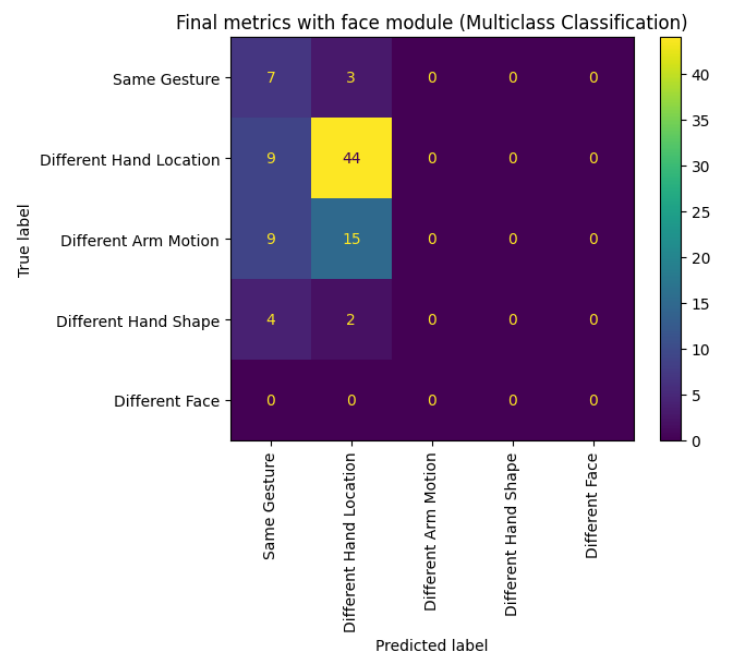
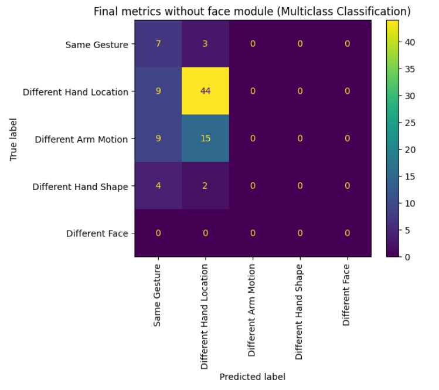

[#rnd]
== Results and Discussion

This chapter details the data gathered from following the procedures outlined in <<methodology>>. It also discusses insights regarding this data.

[#results]
=== Results

A model was successfully created as described in <<methodology>>: <<model>> and assessed as described in <<methodology>>: <<assessment>>. This assessment involves two tasks: a binary classification task and a multiclass classification task.

[#binary-res]
==== Binary Classification

The sampling methods for the binary classification task is described in <<binary>>. 16 gestures were used for this task. For each of these, a random video was chosen as a reference video for other videos to be compared to. 15 samples, or pairs, were made with a random different video of the same gesture to serve as correct attempts, and 15 samples were made with a random video of a random different gesture to serve as incorrect attempts. In total, 478 samples were used (16 gestures * (15 correct pairings + 15 incorrect pairings) = 480 samples, with two sample outliers).

:fig-label-locgraph: {fig-label} {counter:fig}
.{fig-label-locgraph}. Example of threshold lookup graph (Location module).
[#fig-locgraph]
image::../images/sample-graph.png[Threshold graph, scaledwidth=50%]

Finding the best threshold in each module required generating a graph to visualize the possible evaluation metrics for an experimental threshold. While it is ideal to find a threshold that produces high accuracy and precision, higher recall was prioritized to reduce the number of false negatives. The figure above (<<fig-locgraph,{fig-label-locgraph}>>) is an example of a graph used to find the best threshold for the location module. 

:fig-label-locmod: {fig-label} {counter:fig}
.{fig-label-locmod}. Performance metrics and confusion matrix for location module.
[#fig-locmod]
image::../images/location-module.png[Performance metrics and confusion matrix for location module, scaledwidth=50%]

Multiple experimental thresholds were tested on the location module across four iterations to identify the threshold that achieves the most balanced performance metrics. <<fig-locmod,{fig-label-locmod}>> presents the performance metrics and confusion matrix for the optimal threshold selected for the location module. The threshold set at 98.50% produced the highest, balanced metrics out of the iterations, with 71.67% accuracy, 65.43% precision, 89.83% recall, and 75.71% F1 score.

:fig-label-motionmod: {fig-label} {counter:fig}
.{fig-label-motionmod}. Performance metrics and confusion matrix for motion module.
[#fig-motionmod]
image::../images/motion-module.png[Performance metrics and confusion matrix for motion module, scaledwidth=50%]

<<fig-motionmod,{fig-label-motionmod}>> shows the performance metrics and the confusion matrix for the optimal threshold set for the motion module. The experimental threshold set at 50.0% yielded the following performance scores: 49.17% accuracy, 49.17% precision, 100% recall, and an F1 score of 65.92%. Further explanation on the confusion matrix results will be addressed in <<discussion>>.

:fig-label-shapemod: {fig-label} {counter:fig}
.{fig-label-shapemod}. Performance metrics and confusion matrix for shape module.
[#fig-shapemod]
image::../images/shape-module.png[Performance metrics and confusion matrix for shape module, scaledwidth=50%]

<<fig-shapemod,{fig-label-shapemod}>> shows the performance metrics and the confusion matrix for the optimal threshold set for the shape module. The selected experimental threshold at 92.0% resulted in performance metrics of 56.67% for accuracy, 53.21% for precision, 98.31% for recall, and an F1 score of 69.05%.

:fig-label-facemod: {fig-label} {counter:fig}
.{fig-label-facemod}. Performance metrics and confusion matrix for face module.
[#fig-facemod]
image::../images/face-module.png[Performance metrics and confusion matrix for face module, scaledwidth=50%]

In the last module, <<fig-facemod,{fig-label-facemod}>> shows the performance metrics and the confusion matrix for the optimal threshold set for the face module. The experimental threshold set at 99.0% produced the following performance metrics: 55.83% accuracy, 52.73% precision, 98.31% recall, and an F1 score of 68.64%.

:fig-label-overallbin: {fig-label} {counter:fig}
.{fig-label-overallbin}. Overall binary classification model (with face module).
[#fig-overallbin]
image::../images/overall-binary-with-face.png[Binary classification model with face, scaledwidth=50%]

The experimental thresholds that produced the highest and most balanced metrics for each module were then combined to evaluate the overall performance of the model. <<fig-overallbin,{fig-label-overallbin}>> shows the performance metrics and confusion matrix of the model with the combined experimental thresholds for each module. The model had 73.33% accuracy, 68.0% precision, 86.44% recall, and 76.12% F1 score. 

:fig-label-overallbin1: {fig-label} {counter:fig}
.{fig-label-overallbin1}. Overall binary classification model (without face module).
[#fig-overallbin1]
image::../images/overall-binary-without-face.png[Binary classification model without face, scaledwidth=50%]

To provide a basis for comparison with cite:[paudyal19] work, a model without the face module was also evaluated. <<fig-overallbin1,{fig-label-overallbin1}>> shows the performance metrics and the confusion matrix of the model excluding the face module. The model had 71.67% accuracy, 65.82% precision, 88.14% recall, and 75.36% F1 score.

:table-label-modules: {table-label} {counter:table}
.{table-label-modules}. Individual module metrics.
[#table-module-results]
[%header,cols=6*]
|===
s|Module
s|Threshold
s|Accuracy
s|Precision
s|Recall
s|F1 Score

h|Location
>|0.985
>|71.67%
>|65.43%
>|89.83%
>|75.71%

h|Movement
>|0.500
>|49.17%
>|49.17%
>|100.0%
>|65.92%

h|Shape
>|0.920
>|56.67%
>|53.21%
>|98.31%
>|69.05%

h|Face
>|0.990
>|55.83%
>|52.73%
>|98.31%
>|68.64%
|===

<<table-module-results,{table-label-modules}>> shows the metrics obtained by each individual module when used on the testing data. As mentioned in <<binary>>, experimental thresholds with high recall are prioritized to reduce the number of false negatives. Each module can be seen to have performed decently as independent modules, with the location performing better than the other modules.

:table-label-models: {table-label} {counter:table}
.{table-label-models}. Model metrics with and without face module.
[#table-model-results]
[%header,cols=5*]
|===
s|Model
s|Accuracy
s|Precision
s|Recall
s|F1 Score

h|With face
>|73.33%
>|68.00%
>|86.44%
>|76.12%

h|Without face
>|71.67%
>|65.82%
>|88.14%
>|75.36%
|===

<<table-model-results,{table-label-models}>> shows the metrics achieved by combining the modules. Compared to the individual modules seen in <<table-module-results,{table-label-modules}>>, combining the modules led to better performance metrics overall. The model excluding the face module was also included to determine the impact of including a facial features module, as well as to assess the performance in comparison to the original work of cite:[paudyal19].

[#multiclass-res]
==== Multiclass Classification

To assess the feedback of the model, multiclass classification was used. The multiclass classification evaluates the model's effectiveness in correctly identifying the component that differentiates between the two videos of different gestures.

:fig-label-overallmulti: {fig-label} {counter:fig}
.{fig-label-overallmulti}. Overall multiclass classification model (with face module).
[#fig-overallmulti]

<<fig-overallmulti,{fig-label-overallmulti}>> shows the confusion matrix for the multiclass classification test for the model.

:fig-label-overallmulti1: {fig-label} {counter:fig}
.{fig-label-overallmulti1}. Overall multiclass classification model (without face module).
[#fig-overallmulti1]

<<fig-overallmulti1,{fig-label-overallmulti1}>> shows the confusion matrix for the multiclass classification test for the model excluding the face module.

:table-label-feedback: {table-label} {counter:table}
.{table-label-feedback}. Model feedback metrics with face module.
[#table-feedback]
[%header,cols=4*]
|===
s|Component
s|Precision
s|Recall
s|F1 Score

h|None
>|24.00%
>|70.00%
>|36.00%

h|Location
>|69.00%
>|83.00%
>|75.00%

h|Movement
>|
>|
>|

h|Shape
>|
>|0%
>|

h|Face
>|
>|
>|
|===

<<table-feedback,{table-label-feedback}>> shows the precision, recall, and f1 scores of the model for each of its expected outputs. Due to certain limitations in the dataset, some classes were uncomputable or received metrics of 0%. Due to the lack of samples which warrant facial expression feedback, the inclusion of a facial feature module cannot be assessed.

[#discussion]
=== Discussion

The thresholds set for the modules were experimentally chosen in an attempt to balance the different metrics. The model works by chaining together modules by only deeming a pairing correct if all modules output that the pairing is correct. Each additional module only identifies more negative samples. Because of this, while it is ideal for each module to achieve high accuracy and precision, it is also important to maintain a high recall to limit the number of false negatives.

As seen in Table 1, only the location module seems to be somehow capable of classifying the difference between a video of gesture to another. Meanwhile, as seen in Table 2, combining all the four modules together achieves better performance metrics compared to the performance of the individual modules. This shows that combining the modules can create a better performing model overall.

To determine the effects of the inclusion of the facial features module, a model without the face module was also tested. Compared to individual modules, this model also achieves a better overall performance. Compared to the model which includes the face module, there is a marginal decrease in the overall performance metrics. According to the confusion matrices, the model including the face module was able to correct four samples from the model without the face module.

While these results prove the model is somewhat effective, they fall short of the results obtained by Paudyal et al. cite:[paudyal19]. This may be due to the use of a different dataset, as well as discrepancies in the processing of the data. Some of the gestures that Paudyal et al. cite:[paudyal19] used in their work are somewhat more static in nature than dynamic. The gestures selected in this study are greetings and phrases, which are more dynamic thus more complicated to process. Paudyal’s work also includes a significantly larger sample size compared to the present study. 

Other modules also had their limitations. The motion module as an individual module is seen to be less effective than it is expected to be. This could be explained by the reduced effectiveness of the dynamic time warping algorithm as the length of the time series increases.

The hand shape module also faced challenges but showed potential for further improvement. Paudyal et al. cite:[paudyal19] originally utilized CNNs in their study.  CNNs can be difficult to apply effectively to small datasets since they are typically data-intensive models designed to learn complex patterns from large amounts of data. This study diverged from the typical use of CNNs due to the limited size of the dataset.